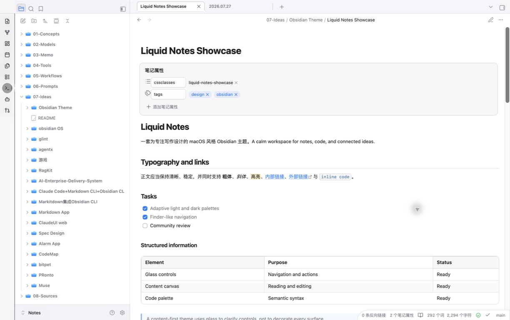
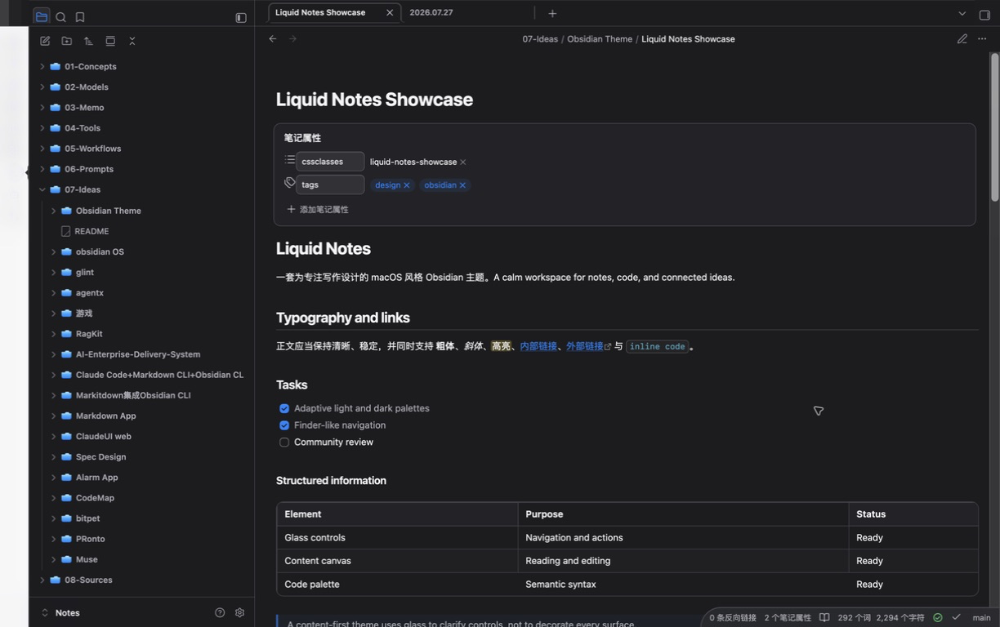

# Liquid Notes

Liquid Notes is a calm, macOS-inspired Liquid Glass theme for [Obsidian](https://obsidian.md). It keeps notes on a stable content canvas while reserving translucent materials for navigation, controls, menus, and dialogs.

> Liquid Notes is an independent open-source project. It is not affiliated with or endorsed by Apple Inc. or Obsidian.


## Features

- Adaptive light and dark appearances that follow Obsidian's system setting.
- macOS system-blue accents: `#007AFF` in light mode and `#0A84FF` in dark mode.
- Finder-like sidebars, compact source lists, segmented tabs, and capsule controls.
- Xcode-inspired multicolor code in both Live Preview and Reading view.
- Native font stacks: San Francisco and PingFang for text, SF Mono for code, with safe cross-platform fallbacks.
- Cohesive Markdown, properties, tables, tasks, callouts, Bases, Canvas, Graph, PDF, settings, and mobile styling.
- Reduced-motion, increased-contrast, reduced-transparency, and no-blur fallbacks.
- No remote fonts, images, scripts, tracking, or required companion plugin.

## Screenshots

| Light | Dark |
| --- | --- |
|  |  |

## Requirements

- Obsidian 1.12.7 or newer.
- Translucent window effects depend on platform and Obsidian's **Settings → Appearance → Translucent window** option.
- On systems without Apple fonts, Liquid Notes uses the native system UI and monospace fonts.

## Install from the Obsidian theme browser

After the theme is accepted into the community directory:

1. Open **Settings → Appearance**.
2. Next to **Themes**, choose **Manage**.
3. Search for **Liquid Notes** and choose **Install and use**.

## Install locally

Download this repository, then run:

```bash
./scripts/install-local.sh "/path/to/your/vault"
```

Alternatively, copy `manifest.json` and `theme.css` into:

```text
<vault>/.obsidian/themes/Liquid Notes/
```

Reload Obsidian and select **Liquid Notes** under **Settings → Appearance → Themes**. To uninstall a local copy, switch to another theme and remove that `Liquid Notes` theme folder.

## Design and compatibility

Liquid Notes follows Obsidian's semantic CSS variables first, then applies narrowly scoped component rules. The editor and reading canvas stay opaque for legibility; glass-like effects are limited to the functional layer. Third-party plugins inherit the theme through Obsidian variables wherever possible.

The theme styles the Lucide icon elements already provided by Obsidian and adds original CSS folder/document marks. It does not include Apple SF Symbols, Apple fonts, or Apple Design Resources. See [Third-party notices](THIRD_PARTY_NOTICES.md).

## Development

The test suite uses Node.js built-in modules and a local Chrome/Chromium binary; it downloads no packages:

```bash
node tests/validate-theme.mjs
```

The validator checks the theme manifest, banned remote/private resources, real browser-computed styles across desktop/mobile/accessibility environments, the local installer, and release images.

## License

Liquid Notes is available under the [MIT License](LICENSE).

---

# Liquid Notes 中文说明

Liquid Notes 是一款以 macOS Liquid Glass 为灵感的 Obsidian 社区主题。它让正文保持稳定清晰，仅在导航、控件、菜单和弹窗等功能层使用通透材质。

## 主要特性

- 浅色与深色模式跟随 Obsidian 的系统外观设置。
- 浅色使用 `#007AFF`、深色使用 `#0A84FF` 系统蓝。
- Finder 风格侧边栏、紧凑列表、分段式标签页和胶囊控件。
- 编辑模式和阅读模式统一的 Xcode 风格多色代码。
- 正文优先使用 San Francisco/PingFang，代码优先使用 SF Mono，并提供跨平台回退。
- 覆盖常用 Markdown、属性、表格、任务、Callout、Bases、Canvas、Graph、PDF、设置和移动端布局。
- 支持减少动态效果、增强对比度、降低透明度及无模糊回退。
- 不加载远程字体、图片或脚本，不追踪数据，也不要求安装配套插件。

## 本地安装

```bash
./scripts/install-local.sh "/你的/vault/路径"
```

也可以把 `manifest.json` 和 `theme.css` 复制到：

```text
<vault>/.obsidian/themes/Liquid Notes/
```

重新加载 Obsidian 后，在“设置 → 外观 → 主题”中选择 **Liquid Notes**。正式进入社区主题目录后，也可以直接在 Obsidian 的主题浏览器中安装、更新和卸载。

本项目是独立开源项目，与 Apple Inc. 或 Obsidian 无隶属或背书关系。
